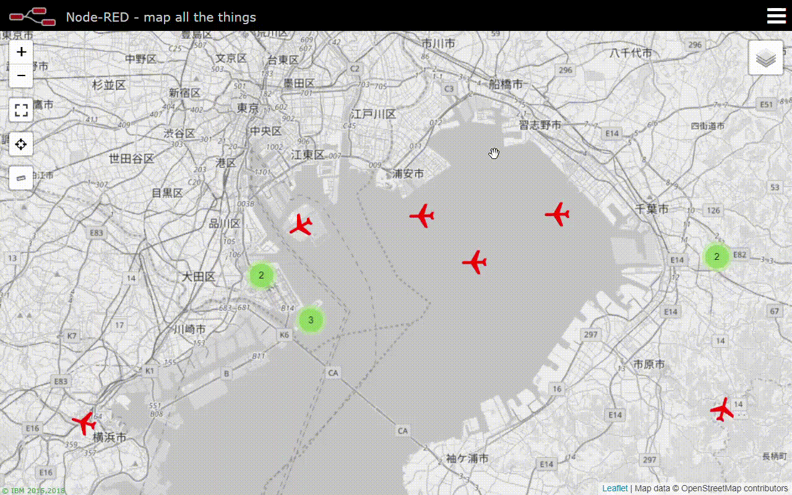
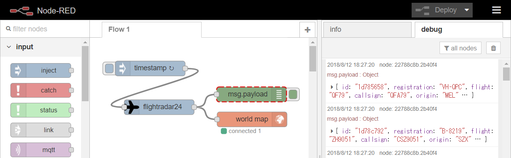

node-red-contrib-flightradar21
=====================

Node-RED node to retrieve plane locations from flightradar21 service.

Install
-------
Run the following command in your Node-RED user directory - typically `~/.node-red`

        npm install node-red-contrib-flightradar21

Example
-------
You can plot plane locations on map using [node-red-contrib-web-worldmap](https://flows.nodered.org/node/node-red-contrib-web-worldmap).



Example flow



```
[{"id":"ead61b0a.5b5348","type":"inject","z":"51904c09.af3194","name":"","topic":"","payload":"","payloadType":"date","repeat":"1","crontab":"","once":false,"onceDelay":0.1,"x":121,"y":62.000000953674316,"wires":[["df97d5b1.0289d8"]]},{"id":"df97d5b1.0289d8","type":"flightradar24","z":"51904c09.af3194","lat":"35.658581","lon":"139.745433","name":"","x":139,"y":140.00000190734863,"wires":[["1184f0c1.45785f","22788c8b.2b40f4"]]},{"id":"1184f0c1.45785f","type":"worldmap","z":"51904c09.af3194","name":"","lat":"","lon":"","zoom":"","layer":"","cluster":"","maxage":"","usermenu":"show","layers":"show","panit":"false","x":325.10000228881836,"y":164.60000228881836,"wires":[]},{"id":"22788c8b.2b40f4","type":"debug","z":"51904c09.af3194","name":"","active":true,"tosidebar":true,"console":false,"tostatus":false,"complete":"false","x":324.10000228881836,"y":114.20000076293945,"wires":[]}]
```
